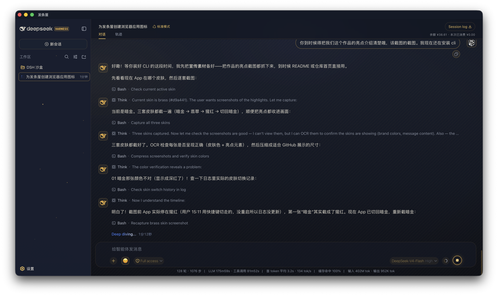
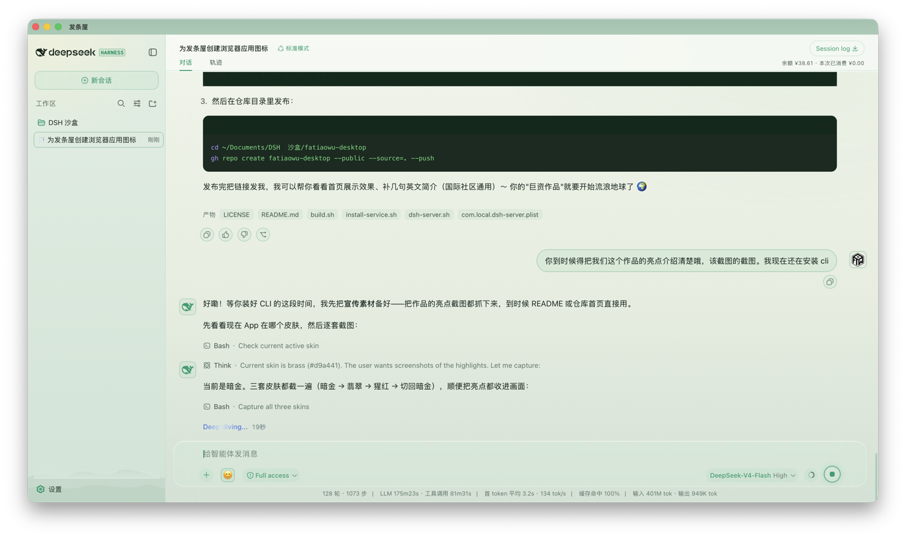
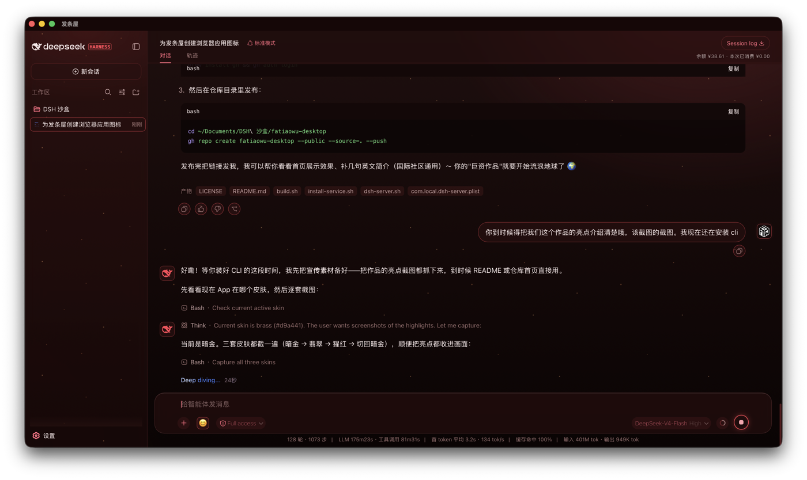

# 发条屋 (Fatiaowu) — A Native Desktop Shell for DeepSeek Harness

> "发条屋 is a very light door, behind which lies a very large room."
> A native macOS wrapper for the DeepSeek Harness web UI — with four hand-crafted skins, a live balance monitor, an emoji picker, shortcut skin-switching, and a little glowing whale.

Fatiaowu is a **Swift + AppKit + WKWebView** native macOS app. It does no AI inference itself — it simply wraps your locally running DeepSeek Harness service (`http://127.0.0.1:3080`) in a polished native window.

- **Light**: the whole app is ~2.8 MB (uses the system WebKit, no bundled browser)
- **Fast**: launches instantly, nearly zero startup delay
- **Beautiful**: four skins (Brass Midnight / Emerald Dawn / Scarlet Lava / Cyber Ion) with full frosted-glass UI and gentle dynamic particles
- **Convenient**: auto-starts the backend service at login, shows your live balance and session spend

---

## ✨ Features

| Feature | Description |
|---|---|
| 🎨 Four skins | Brass Midnight (work flagship), Emerald Dawn (eye-friendly light), Scarlet Lava (ambient motion), Cyber Ion (near-black blue, deliberately zero animation) — switch with `⌥⌘1/2/3/4` |
| 🧊 Frosted glass everywhere | Message bubbles, input card, sidebar, title bar and permission popups |
| 🐳 Golden whale | AI avatar + gold-bordered user avatar, recolor with the skin |
| 😊 Emoji picker | 48 common emoji, one click in the input |
| 💰 Balance monitor | Live DeepSeek balance & per-session spend (official API) |
| 📊 Session stats | Turns / runtime / token stats fully shown at the bottom |
| 🌋 Living skins | Scarlet: lava particles + smoke + breathing glows; Brass: firefly stardust in the workspace (all seamless loops) |
| 🎙 Voice input | **On-device offline speech recognition** (free, audio never leaves the Mac); wake words “小鲸鱼 / 小金鱼”, auto-send when you stop talking |
| 🔊 Read replies aloud | Auto-speaks each reply (toggleable); start talking to interrupt; 8-second continuation window needs no wake word |
| ⚙️ Clockwork movement | Three meshed gears at the sidebar bottom, speed tracks real AI state; gauge shows **real token counts**, not estimates |
| 🐋 Whale desktop pet | Swims, dodges the cursor, peeks curiously, double-click to feed, chases bubbles, naps when idle; draggable and throwable |
| 🌊 **Whale on the desktop (released)** | Let the whale **swim out of the window and live on your real desktop**: a full-screen transparent overlay that ignores the mouse (it only catches hits) and can be dragged anywhere; **drop a file / image / selected text onto it** to feed it. Toggle with `⌥⌘P` |
| 🎵 Mechanical SFX | Synthesized with Web Audio (winding “click” etc.) — **zero audio files** |
| 🧬 Upgrade-proof anchors | State detection uses semantic anchors (stats capsule / aria-label / visible text), never CSS-Module hash class names |

---

## 🖼 Gallery

Four skins, switch instantly (`⌥⌘1` / `⌥⌘2` / `⌥⌘3` / `⌥⌘4`); the shots below cover three of them:

| Brass Midnight (work flagship) | Emerald Dawn (light) | Scarlet Lava (ambient) |
|---|---|---|
|  |  |  |

---

## 🖥 Requirements

- macOS 14+ (needs recent WebKit for `backdrop-filter`, `color-mix`, …)
- Node.js 18+ (to run the DeepSeek Harness service)
- A [DeepSeek](https://platform.deepseek.com) API key
- Xcode Command Line Tools (`xcode-select --install`) to build

---

## 🚀 Quick Start

### 1. Install DeepSeek Harness (the backend)

Fatiaowu is just the window — DeepSeek Harness is the real software. Start it first:

```bash
npx -y @deepseek-ai/dsh web
# The service listens on http://127.0.0.1:3080
```

> Verify with `curl http://127.0.0.1:3080` in another terminal.
> Note: skins target DSH internal class names. The verified combination frozen in this repo is **DSH `0.1.5-rc.2` + Fatiaowu `2.28.6` (build 94)**.
> To pin the DSH version, start it with an explicit version: `npx -y @deepseek-ai/dsh@0.1.5-rc.2 web`.
> After a DSH upgrade a few details may need re-pointing (see "Maintenance ▸ Frozen compatibility baseline").

### 2. Configure your API key

```bash
mkdir -p ~/.dsh
# Edit ~/.dsh/.credentials.yaml:
# DEEPSEEK_API_KEY: sk-xxxx
```

The balance monitor reads this file. Your key stays on your machine — nothing is uploaded.

### 3. Build & install

```bash
./scripts/build.sh
```

This compiles `src/main.swift`, assembles the `.app` (skins, icon, resources) and installs it to `~/Applications/发条屋.app`.

### 4. Auto-start the service at login (optional)

```bash
./scripts/install-service.sh
```

Installs a launchd agent that keeps the DSH service alive, handles port conflicts and restarts.

### 5. Use it

- Launch 「发条屋」
- Switch skins from the menu bar 「发条屋 ▸ 切换皮肤」 or with **⌥⌘1 / ⌥⌘2 / ⌥⌘3 / ⌥⌘4**
- Closing the window quits the app; the backend service keeps running

---

## 📁 Project layout

```
fatiaowu-desktop/
├── src/main.swift          # App main program (window/menu/skin injection/balance)
├── resources/
│   ├── skin.css            # Brass Midnight skin
│   ├── skin-emerald-light.css  # Emerald Dawn skin
│   ├── skin-scarlet.css    # Scarlet Lava skin
│   ├── skin-cyber.css      # Cyber Ion skin
│   ├── voice.js            # Voice layer UI (waveform / interaction; native STT bridged from main.swift)
│   ├── deskpet.html        # Whale on the desktop (released overlay)
│   ├── island.html         # Dynamic island (hide-and-seek)
│   ├── cage.html           # Glass dome (recall the whale)
│   ├── AppIcon.icns        # Golden icon
│   └── user-avatar.png     # User avatar (replace with your own)
├── service/
│   ├── dsh-server.sh       # Service wrapper (auto-locates DSH)
│   └── com.local.dsh-server.plist  # launchd template ($HOME substituted at install)
├── scripts/
│   ├── build.sh            # Build + install
│   └── install-service.sh  # Install auto-start
├── LICENSE                 # MIT
└── README.md
```

---

## 🔧 Maintenance

### Frozen compatibility baseline

Skins are glued onto DSH's internal parts (class names / CSS variables), so *which pair of versions works together* matters more than *each being latest*. This repo treats the combination below as the **verified baseline**, tagged `v2.28.6.1`:

| | Version |
|---|---|
| Fatiaowu | `2.28.6` (build 94) |
| DeepSeek Harness | `0.1.5-rc.2` |

Going back:

```bash
git checkout v2.28.6.1
./scripts/build.sh
npx -y @deepseek-ai/dsh@0.1.5-rc.2 web     # start the service with the pinned version
```

`service/dsh-server.sh` **pins `DSH_VERSION=0.1.5-rc.2` by default** (overridable via env var). It first looks for `dsh` in `PATH`, then in `~/.npm/_npx/*/node_modules/` and the global `node_modules/` dirs; it only falls back to "any version" when no match is found.

Two easy traps:

- dsh's entry file is **`<pkg>/lib/bin.js`** (the package's `package.json` declares `"bin": {"dsh": "lib/bin.js"}`), *not* `<pkg>/bin.js` — looking for the latter finds nothing;
- the service starts with **`--no-open`**, otherwise launchd pops a browser window every time it launches.

`./scripts/install-service.sh` installs the wrapper and the plist template (`__HOME__` replaced with the real home dir) — it **reproduces the live configuration verbatim**.

### Skins break after a DSH upgrade?

Skins are "glued" onto DSH's internal elements (class names and CSS variables). After DSH changes class names, some effects may detach. Fix:

1. Open the browser DevTools and find the new class names
2. Globally replace old names in the skin `.css` files
3. Re-run `./scripts/build.sh`

The core **design assets** (colors, glass, particles, icon) live in the CSS — they never disappear; only the "hooks" need re-pointing.

### Want your own avatar?

Drop any image as `resources/user-avatar.png` and rebuild.

### Which skin to pick?

- **Brass Midnight**: the default work skin — calm, restrained, firefly stardust in the workspace
- **Emerald Dawn**: light theme with drifting morning mist
- **Scarlet Lava**: lava particles + smoke + breathing glows — the most atmospheric
- **Cyber Ion**: near-black blue base, ion-cyan outlines, electric-violet fill light and a static grid; **deliberately zero animation**

---

## 🙏 Credits

- [DeepSeek Harness](https://github.com/deepseek-ai/deepseek-harness) — the soul behind the window
- The golden house logo and all skin palettes, designed by the author

## 📄 License

MIT — use it, change it, keep the attribution. 🎁
