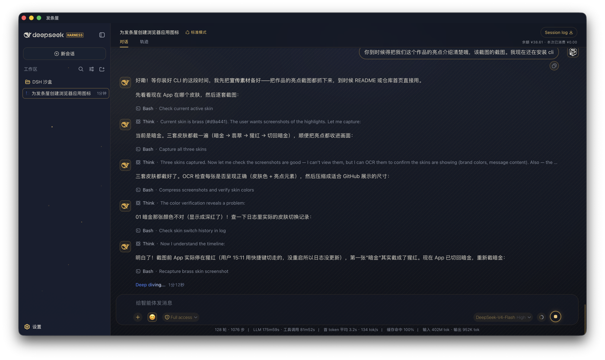
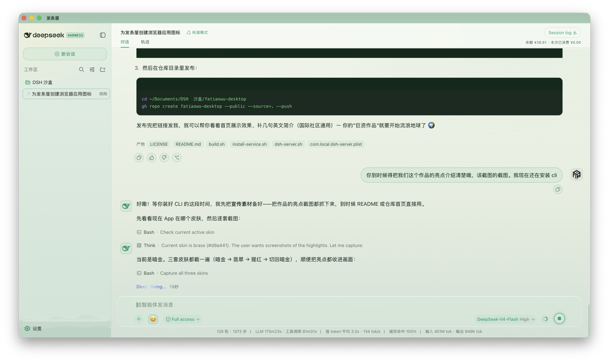
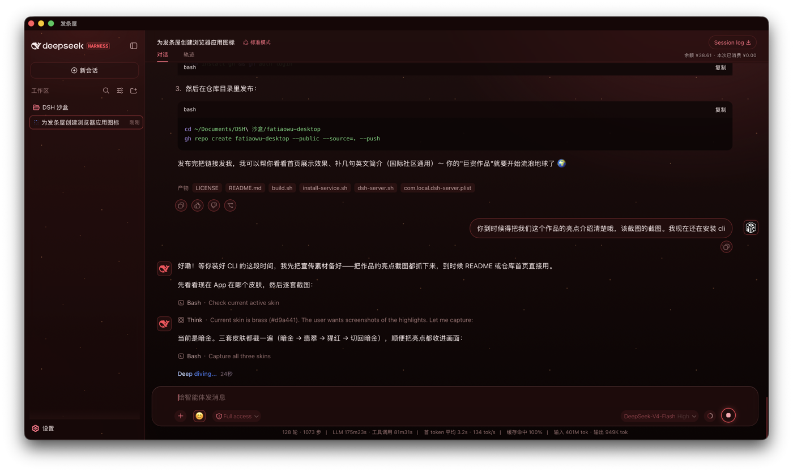

# 发条屋 (Fatiaowu) — DeepSeek Harness 原生桌面外壳

> 「发条屋」是一扇很轻的门，门后是一个很大的房间。
> 用 macOS 原生 WebKit 包裹 DeepSeek Harness Web 界面，配三套手搓皮肤、余额监控、表情面板、快捷键换肤，以及一只会发光的小鲸鱼。

发条屋是一个 **Swift + AppKit + WKWebView** 写的原生 macOS 应用。它不做任何 AI 推理——它只是把你本地跑着的 DeepSeek Harness 服务（`http://127.0.0.1:3080`）装进一个精美的原生窗口里。

- **轻**：整个 App 只有 ~1.6 MB（用系统 WebKit，不打包浏览器）
- **快**：打开即用，几乎零启动延迟
- **美**：三套皮肤（暗金·深夜 / 翡翠·晨光 / 猩红·熔岩），全界面毛玻璃 + 动态粒子
- **省心**：开机自启后台服务，实时显示余额与本次消费

---

## ✨ 特性

| 特性 | 说明 |
|---|---|
| 🎨 三套皮肤 | 暗金·深夜（工作旗舰）、翡翠·晨光（护眼浅色）、猩红·熔岩（动态氛围），`⌥⌘1/2/3` 秒切 |
| 🧊 全界面毛玻璃 | 气泡、输入卡、侧栏、标题栏、权限弹窗全部 frosted glass |
| 🐳 金色小鲸鱼 | AI 头像 + 用户金边头像，随皮肤变色 |
| 😊 表情面板 | 输入框一键插入 48 个常用表情 |
| 💰 余额监控 | 实时显示 DeepSeek 余额与本次会话消费（官方 API） |
| 📊 会话统计 | 底部完整显示轮数/耗时/token 统计 |
| 🌋 动态皮肤 | 猩红熔岩粒子 + 烟尘 + 光晕呼吸；暗金工作区萤火虫星尘（全部无缝循环） |

---

---

## 🖼 一览

三套皮肤，一键切换（`⌥⌘1` / `⌥⌘2` / `⌥⌘3`）：

| 暗金·深夜（工作旗舰） | 翡翠·晨光（浅色护眼） | 猩红·熔岩（动态氛围） |
|---|---|---|
|  |  |  |

## 🖥 系统要求

- macOS 14+（需要较新的 WebKit 以支持 `backdrop-filter`、`color-mix` 等）
- Node.js 18+（运行 DeepSeek Harness 服务）
- 一个 [DeepSeek](https://platform.deepseek.com) API Key
- Xcode Command Line Tools（`xcode-select --install`，用于编译）

---

## 🚀 快速开始

### 1. 安装 DeepSeek Harness（后台服务）

发条屋只是一个窗口，真正的软件是 DeepSeek Harness。先把它跑起来：

```bash
# 安装并启动服务（首次会下载依赖）
npx -y @deepseek-ai/dsh web
# 服务默认监听 http://127.0.0.1:3080
```

> 打开另一个终端验证：`curl http://127.0.0.1:3080` 应返回 HTML。
> 注意：**皮肤依赖 DSH 内部的元素类名**，目前适配版本为 `0.1.0-rc.6`。DSH 升级后个别细节可能需要微调（见下文「维护」）。

### 2. 配置 API Key

```bash
mkdir -p ~/.dsh
# 编辑 ~/.dsh/.credentials.yaml，填入你的 Key：
# DEEPSEEK_API_KEY: sk-xxxx
```

发条屋的余额监控会读取这个文件；你的 Key 只存在自己电脑里，不会上传。

### 3. 编译并安装发条屋

```bash
./scripts/build.sh
```

脚本会：
1. 用 `swiftc` 编译 `src/main.swift`
2. 组装 `.app` 包（皮肤、图标、资源）
3. 安装到 `~/Applications/发条屋.app`

### 4. 让后台服务开机自启（可选）

```bash
./scripts/install-service.sh
```

这会安装一个 launchd 代理，登录后自动启动 DSH 服务，并处理端口冲突与崩溃重启。

### 5. 使用

- 打开「发条屋」即可
- 换肤：菜单栏「发条屋 ▸ 切换皮肤」或快捷键 **⌥⌘1 / ⌥⌘2 / ⌥⌘3**
- 关闭窗口即退出；后台服务不受影响

---

## 📁 项目结构

```
fatiaowu-desktop/
├── src/main.swift          # 应用主程序（窗口/菜单/皮肤注入/余额监控）
├── resources/
│   ├── skin.css            # 暗金·深夜皮肤
│   ├── skin-emerald-light.css  # 翡翠·晨光皮肤
│   ├── skin-scarlet.css    # 猩红·熔岩皮肤
│   ├── AppIcon.icns        # 金色图标
│   └── user-avatar.png     # 用户头像（换成你自己的）
├── service/
│   ├── dsh-server.sh       # 后台服务包装脚本（自动定位 DSH）
│   └── com.local.dsh-server.plist  # launchd 模板（安装时替换 $HOME）
├── scripts/
│   ├── build.sh            # 编译 + 安装
│   └── install-service.sh  # 安装开机自启
├── LICENSE                 # MIT
└── README.md
```

---

## 🔧 维护

### DSH 升级后皮肤失效怎么办？

皮肤是「贴」在 DSH 界面零件上的（靠元素类名和 CSS 变量）。DSH 升级换了类名后，个别效果可能脱钩。修复方法：

1. 打开浏览器 DevTools，找到对应元素的新类名
2. 在对应皮肤的 `.css` 里全局替换旧类名
3. 重新 `./scripts/build.sh`

核心的**设计资产**（配色、玻璃、粒子、图标）都在 CSS 文件里，永远不会丢——要修的只是「挂钩」。

### 想换自己的头像？

把任意图片命名为 `user-avatar.png` 放到 `resources/`，重新 build 即可。

### 三套皮肤怎么选？

- **暗金·深夜**：默认工作皮肤，沉稳克制，有工作区萤火虫星尘
- **翡翠·晨光**：浅色护眼，晨雾流动
- **猩红·熔岩**：熔岩粒子 + 烟尘 + 光晕呼吸，氛围最浓

---

## 🙏 致谢

- [DeepSeek Harness](https://github.com/deepseek-ai/deepseek-harness) — 灵魂所在
- 用户设计的金色小房子 logo 与全部皮肤配色

## 📄 许可

MIT License，随便用，随便改，记得保留署名。🎁
